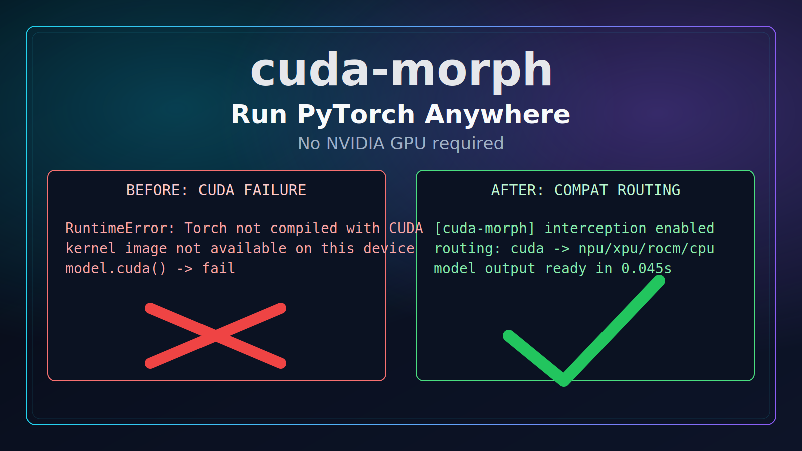
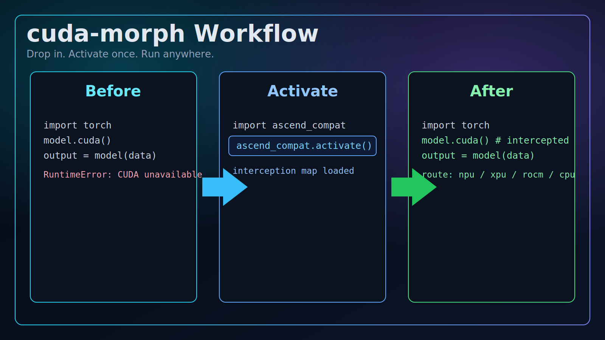
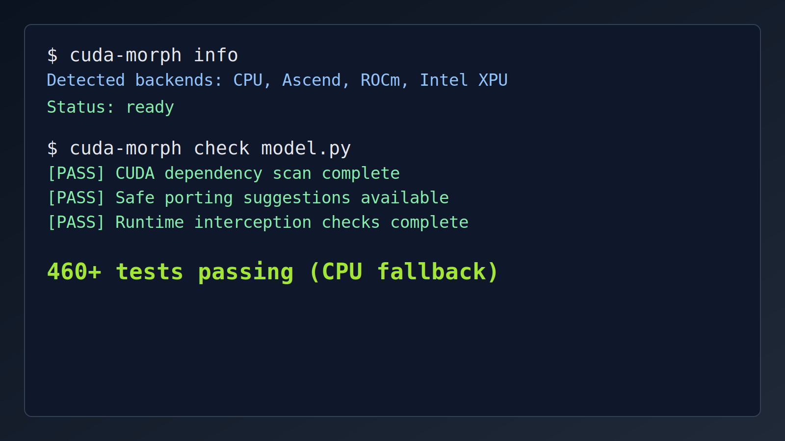
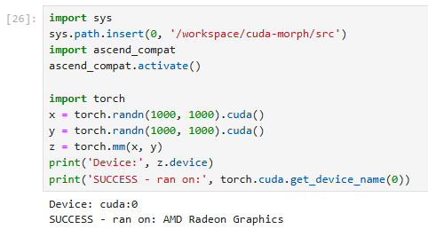

# cuda-morph

Run PyTorch workloads on non-NVIDIA hardware with minimal code changes.

<p>
  
  
  
</p>



Existing CUDA-style PyTorch scripts keep running — `cuda-morph` redirects calls to available backends or falls back to CPU.

---

## Why this exists

A lot of ML code assumes `torch.cuda` everywhere. On non-NVIDIA setups, that often means immediate runtime errors and expensive rewrites.

`cuda-morph` is a runtime compatibility layer that helps you keep the same workflow and ship faster.

---

## Visual walkthrough



1. Start with existing CUDA-oriented code.
2. Activate `cuda-morph`.
3. Run with backend-aware routing and fallback behavior.

---

## Quick start

```bash
pip install cuda-morph
```

```python
import ascend_compat
ascend_compat.activate()

# Existing CUDA-style code stays the same
model = model.cuda()
```

```bash
cuda-morph info
cuda-morph check model.py
```

---

## Core capabilities

- Zero-rewrite activation for many CUDA-style PyTorch flows.
- Backend routing across Ascend / ROCm / Intel XPU / CPU fallback paths.
- CLI tooling for environment checks, porting hints, and validation commands.
- Ecosystem patches for key libraries (current depth varies by backend).

Full matrix: [docs/compatibility_matrix.md](docs/compatibility_matrix.md)

---

## Validation snapshot




- 460+ tests passing in CPU-fallback mode.
- Real hardware proof captured on RunPod AMD ROCm: `.cuda()` matmul ran on `cuda:0` and reported `AMD Radeon Graphics`.
- Core `.cuda()` routing on non-NVIDIA hardware is now validated; broader operator and ecosystem coverage is still in progress.

If you can test on non-NVIDIA accelerators, feedback is highly valuable: [open an issue](https://github.com/JosephAhn23/cuda-morph/issues).

---

## Backend status (current)

| Backend | Hardware | Status |
|---------|----------|--------|
| **Huawei Ascend** | 910B, 310P | Full shim + ecosystem patches (flash-attn, HuggingFace, DeepSpeed, vLLM). Needs hardware validation. |
| **AMD ROCm** | MI210, MI250X, MI300X | Detection + device routing. Ecosystem patches not yet implemented. |
| **Intel XPU** | Max 1550, Flex, Arc | Detection + device routing. Ecosystem patches not yet implemented. |
| **Cambricon** | MLU370, MLU590 | Detection + device routing. Ecosystem patches not yet implemented. |

---

## CLI

```bash
cuda-morph check model.py     # check a script for compatibility issues
cuda-morph port model.py      # generate porting suggestions
cuda-morph doctor             # environment diagnostics
cuda-morph doctor --full
cuda-morph verify --device npu
cuda-morph bench overhead
cuda-morph info
```

---

## Development

```bash
git clone https://github.com/JosephAhn23/cuda-morph.git
cd cuda-morph
pip install -e ".[dev]"
pytest tests/ -v
pytest tests/ -v --run-hardware
```

---

## See also

- [STRATEGY.md](STRATEGY.md)
- [VALIDATION_STATUS.md](VALIDATION_STATUS.md)
- [MIGRATION.md](MIGRATION.md)
- [docs/README_zh.md](docs/README_zh.md)

## License

Apache 2.0
